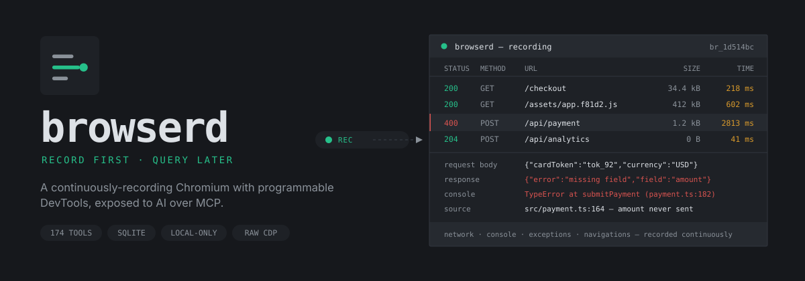
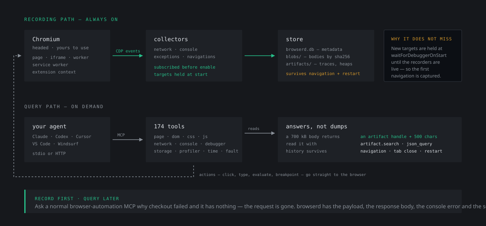

<div align="center">



<br>

**Not "Playwright driven by an LLM" — a browser daemon that records everything it sees,
so your agent can ask about traffic that happened before you thought to ask.**

<br>

[](#the-tool-surface)
[](#testing)
[](https://modelcontextprotocol.io)
[](https://nodejs.org)
[](#security-notes)
[](LICENSE)

</div>

---

## What this actually is

Most browser-MCP servers wrap Playwright and let a model click things. That is a small
fraction of what a developer does with a browser open.

`browserd` runs a **real, headed Chromium you can use yourself** while an agent watches
over its shoulder. It holds a persistent CDP connection, records network, console,
exceptions and navigations **continuously**, and stores them in SQLite. When the model
finally asks a question, it queries a database — not the browser.

<div align="center">
  
</div>

The difference matters. Ask a normal browser-automation MCP "why did checkout fail?"
and it has nothing — the request is gone. Ask `browserd` and it has the payload, the
response body, the console error, the stack trace, and the exact source line.

---

## What your agent can do

| | |
|---|---|
| **See** | Screenshots (viewport / full-page / element) returned as real image blocks. Accessibility snapshots with stable `eNN` refs — cheaper and more reliable than vision for deciding what to click. |
| **Act** | Click, hover, type, key chords, scroll, select, upload, handle dialogs. Falls back to touch dispatch under device emulation. |
| **Network** | Every request with **all** headers (including what actually went on the wire), request payloads, response bodies, initiators, timings, redirect chains, WebSocket frames. Recording is armed before the first page script runs. |
| **Console** | `console.*` output and uncaught exceptions with stacks, **kept across navigations**. Plus `Runtime.evaluate` with the DevTools command-line API (`$`, `$$`, `$x`). |
| **DOM / CSS** | Structural outlines, the full cascade as DevTools shows it, and `css.explain_visibility` — which names the rule that hid your element instead of handing over a stylesheet. |
| **Debugger** | Real breakpoints with conditions, stepping, call frames, scope chains, evaluate-on-frame. Read a local variable off a paused stack. |
| **Storage** | localStorage, sessionStorage, cookies, IndexedDB (read *and* write), Cache Storage, quotas. |
| **Profiling** | CPU sampling, JS coverage, traces streamed to disk, heap snapshots with **constructor-level diffing** for leak hunting, process/CPU info. |
| **Simulation** | A controlled clock, timezone, CPU throttling, network conditions, device emulation, geolocation, vision deficiencies, and fault injection. |

### The bits people don't expect

**Time travel.** `time.run("30m")` advances the clock and fires every timer that comes
due — a 60-second interval fires 30 times, instantly. `time.jump("30m")` leaps forward
firing each timer *once*, the "closed the laptop for three hours" case. Different bug
classes, different tools.

```
time.install({ time: "2030-01-01T00:00:00Z" })   # page now believes it is 2030
time.run({ duration: "30m" })                     # 30 interval ticks, no waiting
time.freeze()                                     # pin it and inspect
```

**Fault injection.** Ask "what does the UI do if Save takes 20 seconds?" and then
actually find out.

```
fault.delay({ url: "**/api/save", delay: "20s" })
fault.replace_response({ url: "**/api/user", status: 500, body: {...} })
fault.drop_next({ url: "**/api/payment", count: 1 })
```

**Leak hunting.** Two heap snapshots and a diff, reported by constructor with detached
DOM nodes called out — the classic leak signature.

**Human ↔ AI handoff.** `inspector.pick` arms the real DevTools element picker so *you*
click the broken thing; the agent reads back a node handle. `page.highlight` goes the
other way.

---

---

## For coding agents: install this yourself

Everything needed to go from a clean checkout to a working MCP server, with no
human in the loop. Run these from the repository root.

### 1. Check prerequisites

```bash
node --version          # must be >= 20.11
```

If Node is missing or older, stop and tell the user — do not attempt to install a
runtime yourself.

Chromium is resolved in this order, and **at least one must exist**:

1. `AGENTBROWSER_CHROMIUM` (an explicit path you set)
2. Playwright's bundled Chromium
3. A system Chrome/Chromium/Edge

```bash
npx playwright install chromium     # the recommended source; ~150MB
```

Prefer Playwright's build: branded Chrome/Edge 137+ removed `--load-extension`,
so the bundled capture panel cannot load on those.

### 2. Build

```bash
npm install
npm run build           # tsc -> dist/
```

Verify the build produced a working CLI:

```bash
node dist/cli.js --tools | head -3     # should print "browserd exposes 174 tools"
```

### 3. Register with the MCP client

```bash
node scripts/install-mcp.mjs           # detects and patches every client found
node scripts/install-mcp.mjs --print   # print the JSON without writing anything
```

It merges into existing config and writes a `.bak` first, so it will not clobber
other servers. Supported: Claude Desktop, Claude Code, Codex CLI (TOML), Cursor,
Windsurf, VS Code.

To write config yourself instead, the stdio entry is:

```json
{
  "mcpServers": {
    "browserd": {
      "command": "node",
      "args": ["<ABSOLUTE_PATH>/dist/cli.js"]
    }
  }
}
```

Use an **absolute** path to `dist/cli.js`. Codex CLI uses TOML instead:

```toml
[mcp_servers.browserd]
command = "node"
args = ["<ABSOLUTE_PATH>/dist/cli.js"]
```

### 4. Verify before reporting success

```bash
node scripts/verify-mcp.mjs
```

This reads each config back, launches exactly what it specifies, and completes a
real MCP handshake. Every registered client should report `174 tools advertised`.
If a client is listed as "no config file", it is simply not installed.

Then confirm the browser itself works:

```bash
node dist/cli.js open --headless --url https://example.com
```

It should print a `browser_id` within a few seconds. Press Ctrl+C to stop.

**The MCP client must be restarted** before it sees the new server. Say so
explicitly rather than assuming the tools are live.

### 5. Confirm end to end (optional but recommended)

```bash
npm run test:discovery      # 9 checks, ~40s: launch, discover, read history
npm run test:live           # 117 checks, ~2min: the full tool surface
```

These launch real Chromium. They use a temporary `AGENTBROWSER_HOME`, so they
never touch real profiles or recordings.

### Calling the tools

The server advertises dotted names (`browser.list`, `network.get_body`). Some
clients rewrite them — Claude Code exposes `browser.list` as
`mcp__browserd__browser_list`. Match whatever your client lists; the underlying
tool is the same.

A first session normally goes:

```
browser.list                     -> find an already-open browser, or none
page.navigate    { url }         -> auto-launches one if needed
page.screenshot                  -> see it
network.summarize                -> what is slow or failing
network.get_request { request_id }
network.get_body    { request_id, as_json: true }
```

`browser_id` is optional everywhere. Omit it and browserd uses the only running
browser, or launches one. Pass it when more than one is open — with several
running, omitting it is an error rather than a guess.

### Things that will bite an agent

| Symptom | Cause and fix |
| --- | --- |
| `no browser is running and autoLaunch is disabled` | Call `browser.launch`, or drop `--no-auto-launch`. |
| `browser_id is required: N browsers are running` | Pass an explicit `browser_id`. |
| Mutating tool returns `control_denied` | Control mode is `observe` or `paused`. Call `browser.set_control_mode { mode: "shared" }`. |
| `branded Chrome/Edge ... removed --load-extension` | Run `npx playwright install chromium`, or set `AGENTBROWSER_CHROMIUM`. |
| Response body is missing | Check `body_state`. `too_large` needs a higher `recorder.maxBodyBytes`; `unavailable` means Chromium evicted it (normal for redirects). |
| A tool returns an `artifact_id` and truncated text | By design. Read it with `artifact.search`, `artifact.read_lines` or `artifact.json_query` — never expect the whole body inline. |
| Queries on a closed browser | Supported. Recorded network and console stay queryable by `browser_id`; only live control is refused. |

### Environment variables

| Variable | Effect |
| --- | --- |
| `AGENTBROWSER_HOME` | Data directory (default `~/.agent-browser`) |
| `AGENTBROWSER_CHROMIUM` | Explicit Chromium path, overriding detection |
| `AGENTBROWSER_HEADLESS` | `1` to auto-launch headless |
| `AGENTBROWSER_NO_BUNDLED_EXTENSIONS` | `1` to skip the capture panel |
| `AGENTBROWSER_LOG_LEVEL` | `trace` \| `debug` \| `info` \| `warn` \| `error` |
| `AGENTBROWSER_PORT` | HTTP port for `--http` mode |

### One-shot install

```bash
node --version
npx playwright install chromium
npm install
npm run build
node scripts/install-mcp.mjs
node scripts/verify-mcp.mjs
```

Then tell the user to restart their MCP client.

---

## Install

*(Handing this to a coding agent? Point it at
[For coding agents](#for-coding-agents-install-this-yourself) above — that section
has the exact commands, verification steps and failure modes.)*

Requires **Node ≥ 20.11**. Chromium is resolved from Playwright's bundled build when
present (branded Chrome 137+ dropped `--load-extension`; the bundled build still has it),
otherwise from a system install.

```bash
git clone <your-remote> browserd && cd browserd
npm install
npm run build
```

### Register it with your MCP client

```bash
node scripts/install-mcp.mjs
```

This detects Claude Desktop, Claude Code, Codex CLI, Cursor, Windsurf and VS Code,
**merges** into their existing config (writing a `.bak` first), and never clobbers other
servers.

```bash
node scripts/install-mcp.mjs --print            # show the JSON, change nothing
node scripts/install-mcp.mjs --client codex     # just one client
node scripts/install-mcp.mjs --headless         # auto-launch headless
node scripts/install-mcp.mjs --http --port 7331 # register the HTTP endpoint instead
```

Supported clients: **Claude Desktop**, **Claude Code**, **Codex CLI**, **Cursor**,
**Windsurf**, **VS Code**. Codex uses `[mcp_servers.browserd]` TOML sections rather than
JSON; the installer edits that file surgically so comments and your other settings survive.

Then confirm every client can actually launch it:

```bash
npm run verify-mcp
```

```
  OK    Claude Code      174 tools advertised
  OK    Codex CLI        174 tools advertised
  OK    VS Code          174 tools advertised
```

This reads the real config files and completes an MCP handshake with whatever they
specify, so a stale path or hand-edited entry is caught rather than assumed working.

Or add it by hand:

```json
{
  "mcpServers": {
    "browserd": {
      "command": "node",
      "args": ["/absolute/path/to/browserd/dist/cli.js"]
    }
  }
}
```

Restart your client. **No browser needs to be open** — the first tool call that needs
one launches it.

### Open a browser you drive yourself

This is the workflow browserd is built around. Run:

```bash
npm run open                     # or: node dist/cli.js open
node dist/cli.js open --url https://localhost:3000
```

Or skip the commands entirely: double-click **`launchers/AI Browser.bat`**
(macOS and Linux: `launchers/ai-browser.sh`). It is a menu — open a browser, open
one at a URL, pick a profile, see what is running, check disk usage, clean up, or
register with your AI client. It shows running browsers at the top, offers to
build itself on first run, and accepts `localhost:3000` as readily as a full URL.

A normal Chromium window opens with your persistent profile and the capture
panel installed. **Use it however you like.** From the moment it starts, network,
console, exceptions and navigations are being recorded — no agent has to be
connected, and nothing has to be armed.

```bash
node dist/cli.js list            # every browser currently running
```

Hours later, start a fresh MCP session and ask your agent to look. It finds the
window you already have open, attaches to it, and can read everything that
happened before it existed:

> The checkout on that tab failed earlier. What went wrong?

It will find the request in the recording, read the payload and the response
body, pull the console error and stack, and point at the source line — for
traffic that happened long before the agent connected.

Browsers advertise themselves in `~/.agent-browser/run/browsers/`, so discovery
works across processes and survives an MCP session ending. Records for browsers
that have exited are reaped automatically.

### Try it

Ask your agent:

> Open news.ycombinator.com, show me a screenshot, then tell me every request that took
> longer than 500ms and what the slowest one returned.

Or, for the full pitch:

> Go to my app at localhost:3000, click Checkout, and tell me why it fails.

It will screenshot the failure, read the console error, find the failing request, show
you the payload and the 400 response body, grep the loaded sources for the calling
function, and hand you the file and line.

---

## Running the daemon directly

```bash
node dist/cli.js open            # open a browser that records; discoverable later
node dist/cli.js list            # show every running browser
node dist/cli.js                 # MCP over stdio (default)
node dist/cli.js --http          # Streamable HTTP on 127.0.0.1:7331/mcp
node dist/cli.js --tools         # print the tool surface and exit
node dist/cli.js --help
```

| Flag | Meaning |
|---|---|
| `--port N` | HTTP port (default 7331; `0` picks a free one) |
| `--host HOST` | HTTP bind address (default `127.0.0.1` — **do not expose publicly**) |
| `--profile NAME` | Profile used by auto-launched browsers |
| `--headless` | Auto-launch headless. Default is a visible window you can also use |
| `--no-auto-launch` | Never spawn implicitly; require `browser.launch` |
| `--log-level LEVEL` | `trace` \| `debug` \| `info` \| `warn` \| `error` |

Env: `AGENTBROWSER_HOME`, `AGENTBROWSER_PORT`, `AGENTBROWSER_LOG_LEVEL`, `AGENTBROWSER_HEADLESS`.

HTTP mode binds loopback only and validates `Origin` — this endpoint is full browser
control, and a page on the open web must not be able to reach it.

---

## Two design rules

### 1. Record first, query later

Chromium pushes events; the daemon persists them. Nothing has to be armed in advance and
no event is missed while the model is thinking. History survives navigation, tab close
and daemon restart.

This is load-bearing: collectors subscribe to CDP events **before** enabling the domain,
and the target manager holds new targets at `waitForDebuggerOnStart` until instrumentation
is live. That is what makes "we did not miss the request" true rather than probable.

### 2. Large payloads never enter the context

A 200MB response is stored as a content-addressed blob and returned as an artifact handle.
The agent reads it with `artifact.search`, `artifact.read_lines` or `artifact.json_query`
(a JSONPath subset). Same for traces, heap snapshots, DOM dumps and console exports.

Tools are query-first by design: `dom.summary` before `dom.get_html`,
`network.summarize` before `network.list_requests`, `js.search_source` before
`js.get_source`.

---

## Human and AI on one browser

The browser is headed and yours. `browser.set_control_mode` arbitrates:

| mode | meaning |
|---|---|
| `observe` | AI reads everything, changes nothing |
| `shared` | both drive (default) |
| `agent` | AI owns input |
| `paused` | AI frozen; reads still work |

Every mutating tool checks this — including the raw `cdp.send` escape hatch.

---

## The tool surface

174 tools. `node dist/cli.js --tools` lists them all.

```
browser.*      list, launch, connect, status, list_targets, set_control_mode, close
page.*         navigate, screenshot, snapshot, click, type, press, scroll, extract_text,
               wait_for, highlight, dialogs, viewport, frames, tabs
dom.*          summary, query, inspect, get_html, set_html, set_attribute, remove, export
css.*          computed, matched_rules, set_style, stylesheets, explain_visibility
js.*           evaluate, list_scripts, get_source, search_source
console.*      query, exceptions, export, clear
network.*      list_requests, get_request, get_body, summarize, search_bodies,
               list_websockets, ws_messages, export_har, simulate, clear
storage.*      local/session, cookies, indexeddb, caches, usage, export
debugger.*     enable, breakpoints, pause, resume, step, call_frames,
               evaluate_on_frame, inspect_object, wait_for_pause
inspector.*    pick, picked, element, parents, children, snapshot, accessibility_tree
profile.*      start/stop/status (presets: cpu, slow-page, hang, memory-leak, full)
profiler.*     cpu, coverage, trace, long_tasks
memory.*       heap.snapshot, heap.compare, gc, usage
time.*         install, freeze, run, jump, resume, set_fixed_date, set_wall_clock, virtual
device.*       preset, viewport, orientation, reset
environment.*  timezone, locale, color_scheme, reduced_motion, vision, status, reset
fault.*        abort, delay, replace_response, drop_next, modify_headers, list, clear
artifact.*     list, stat, read, read_lines, search, json_query, export
cdp.send       escape hatch to any raw CDP method
```

---

## Testing

```bash
npm test                      # build + live MCP suite + HTTP suite
npm run test:live             # 117 checks: real MCP client, real Chromium, local fixture
npm run test:live:headed      # same, with a visible window
npm run test:deep             # 35 checks against a real public site
npm run test:extension        # 7 checks: the bundled panel in a real browser
npm run test:discovery        # 9 checks: cross-process discovery and late attach
npm run test:http             # Streamable HTTP transport + origin guard
npm run test:real             # headed narrated walkthrough on live sites
```

Every suite spawns the **actual server** and connects a **real MCP client** — assertions
go through `tools/call`, so schema validation, handler wiring and ops are covered together.

They assert behaviour, not that a call returned:

- a 400's **request payload and response body** are both readable
- a 700KB response comes back as an artifact with ~500 chars inline
- `time.run("30m")` fires a 60s interval **exactly 30 times**; `time.jump` fires it **once**
- a **local variable is read off a paused call frame** (`total=75`, `tax=15`)
- `observe` mode **denies 3/3 mutations while allowing reads**
- an exported HAR **parses back as valid HAR 1.2**
- a heap snapshot **loads as a real `.heapsnapshot`**

`tests/deep-dive.mjs` runs against live Hacker News: 14 real requests recorded with
`h2`/nginx/remote-IP detail, a 34KB response body read off the wire, 1285-node DOMSnapshot,
1603-node accessibility tree, and an 8MB heap delta detected.

---

## The bundled capture panel

Every **headed** browser browserd launches comes with
[Context Capsule](extensions/context-capsule) already installed — a side panel that
lets *you* point at the broken thing and package it for an agent: the region you
drew, the DOM under it, computed CSS, console, network and storage, with
credential-shaped data redacted.

It complements the MCP surface rather than duplicating it. browserd records
continuously and answers an agent's questions; the panel is the human half —
select the component, describe the change, seal the evidence.

The vendored copy has the extension's own native-messaging/MCP export **removed**:
browserd is already the agent interface, and running two evidence pipelines would
mean a second host process to install. Capsules are written through
`chrome.downloads` instead, so nothing extra is required.

```bash
npm run vendor:extension          # refresh from ../Fe-shot
npm run vendor:extension -- --source /path/to/Fe-shot
npm run vendor:extension:check    # fail if the vendored copy is stale
npm run test:extension            # verify it loads into a real browser
```

The transform is asserted, not best-effort: if upstream changes shape, the vendor
step fails loudly instead of silently shipping a half-stripped extension.

Skip it per launch with `bundledExtensions: false`, or globally with
`AGENTBROWSER_NO_BUNDLED_EXTENSIONS=1`. It is skipped automatically when headless
(no UI to show) and on branded Chrome/Edge 137+, which cannot sideload at all.

---

## Where your data lives (and how to clean it)

Everything the daemon records goes to `~/.agent-browser` (override with
`AGENTBROWSER_HOME`):

| Path | Contents | Grows with |
|---|---|---|
| `browserd.db` | SQLite: requests, console, exceptions, websockets, navigations, targets | pages visited |
| `blobs/` | Request/response bodies, content-addressed by sha256 | traffic recorded |
| `artifacts/` | Screenshots, HARs, traces, heap snapshots, exports | tools called |
| `profiles/` | Chromium user-data dirs — **cookies and session tokens** | browsers launched |
| `logs/` | `browserd.log` | uptime |

Bodies and snapshots live outside SQLite, so the database stays small even after
heavy use. Profiles are usually the largest item by far.

```bash
npm run data              # report only: sizes, file counts, row counts, oldest recording
npm run data:clean        # wipe recordings + orphaned blobs, then VACUUM
npm run data:artifacts    # delete screenshots / HARs / traces / heap snapshots
npm run data:profiles     # delete browser profiles (logs you out everywhere)
npm run data:reset        # all of the above
```

The bare `npm run data` deletes nothing — it prints what is stored so you can decide.
Destructive runs confirm first (`--yes` to skip), and deleting profiles prints an
explicit warning because it drops your logged-in sessions.

Keep recent data and drop the rest:

```bash
node scripts/clean-data.mjs --recordings --older-than 7d --vacuum
node scripts/clean-data.mjs --artifacts --older-than 24h --yes
```

Blob deletion is reference-checked: a body is only removed once no surviving row
still points at it, so trimming by age cannot orphan a request from its payload.

---

## Layout

```
src/
  cdp/        persistent WebSocket, flat-session multiplexing
  browser/    launcher, target manager (auto-attach + debugger hold), registry, faults
  collect/    network, console, page and execution-context recorders
  store/      SQLite schema, blob store, artifact store
  ops/        the actual capabilities, independent of MCP
  mcp/        tool definitions and server wiring
  cli.ts      stdio / HTTP entry point
tests/        live MCP suites
scripts/      install-mcp.mjs
```

MCP is *one interface* onto the daemon, not the daemon itself. `src/index.ts` exports the
core so a CLI, REST layer or test harness can drive it directly.

Data lives in `~/.agent-browser` (`AGENTBROWSER_HOME` to move it): `browserd.db`,
`blobs/`, `artifacts/`, `profiles/`, `logs/`.

---

## Security notes

- Bind loopback only. This endpoint is **complete control of a browser holding your
  logged-in sessions**.
- Browser profiles under `~/.agent-browser/profiles` contain cookies and session tokens.
  Recorded bodies contain whatever the pages you visited returned. Both are gitignored;
  keep them that way.
- `--net-log-capture-mode=Everything` can include raw bytes off the wire. Use it only on
  traffic you own.
- `cdp.send` is unrestricted CDP, gated only by control mode.

---

## Known limits

- `Debugger.setScriptSource` live edit is gone from current Chromium — edit source and reload.
- `Network.getRequestPostData` can omit files from multipart uploads, so "every byte of
  every upload" is not guaranteed by that path alone. Launch with `capture_netlog` for
  stack-level detail (DNS, sockets, TLS).
- The controlled clock is a fake-timer shim installed via
  `addScriptToEvaluateOnNewDocument`, not Playwright's Clock API, since the daemon speaks
  raw CDP. `time.virtual` exposes Chromium's own virtual-time policy; the two cannot be
  combined on one target and the daemon refuses to stack them.
- Touch emulation deliberately does **not** set `Emulation.setEmitTouchEventsForMouse`:
  that flag makes Chromium stop acknowledging `Input.dispatchMouseEvent` permanently.
  `page.click` synthesises taps instead.
- `ontouchstart in window` is decided at document creation, so it appears after a reload.
  `navigator.maxTouchPoints` is live immediately.
- `Target.openDevTools` (`devtools.open`) is experimental and some builds refuse it.
- Sensor emulation is not implemented. Raw process memory read/write is out of scope —
  that needs a separate debugger adapter.

---

## Credits

Designed and built by **[Ranit Bhowmick](https://ranitbhowmick.com)**.

The bundled capture panel is [Context Capsule](extensions/context-capsule), also
by the same author — see [`brand/BRAND.md`](brand/BRAND.md) for browserd's own
design system.

## License

MIT © [Ranit Bhowmick](https://ranitbhowmick.com)

---

<div align="center">
<sub><b>record first · query later</b><br>
The automation is the least interesting thing it does.</sub>
</div>
